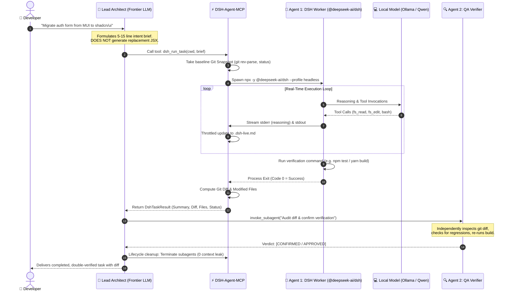

# 📖 DSH-Agent-MCP: Product Architecture & System Flow Guide

> **Document Purpose:** Complete architectural breakdown, product identity guide, end-to-end execution flow, and folder structure reference for `dsh-agent-mcp`.

---

## 1. What Exactly is This Tool / Product?

**DSH-Agent-MCP** is an open-source **Model Context Protocol (MCP) server and multi-agent orchestration engine** that bridges **Frontier AI IDEs** (Google Antigravity, Claude Code, Cursor, Cline) with **DeepSeek Harness (`@deepseek-ai/dsh`)** running on **local or free open-source LLMs** (Ollama, vLLM, LM Studio, FreeToken).

### The Core Problem It Solves
1. **The Cost Dilemma:** Using expensive frontier models (Gemini 1.5 Pro, Claude 3.5 Sonnet, GPT-4o) to write hundreds of lines of repetitive boilerplate, mechanical refactoring, or iterative test fixes burns huge amounts of paid API tokens.
2. **The "Spoon-Feeding" Trap:** When frontier models attempt to write all code directly, they often micromanage line numbers, generate incomplete snippets, or hallucinate subtle regressions.
3. **The Review Gap:** When a single agent edits code and self-evaluates, it frequently suffers from confirmation bias, missing bugs or broken imports.

### The Solution: The Architect & Dual-Agent Pattern
Instead of letting the expensive frontier model write code, **DSH-Agent-MCP** enforces a strict **Dual-Agent Architecture**:
- **Frontier Model = Lead Architect:** Never writes code blocks. Formulates high-level intent briefs (goals, target files, invariants, test commands).
- **Agent 1 = Task Completion Worker (DSH):** Operates at **$0 cost** on your local/free cluster (e.g. Qwen 2.5 Coder 32B or Qwen 35B). Reads files, edits AST, writes code, and runs builds autonomously.
- **Agent 2 = Reviewer & QA Verifier:** Rigorously audits the git diff, checks for regressions, independently runs the test suite, and issues a formal `[CONFIRMED / APPROVED]` verdict.

---

## 2. High-Level System Architecture

```
┌────────────────────────────────────────────────────────────────────────┐
│                        IDE HOST LAYER (Frontier)                       │
│     Google Antigravity  •  Claude Code / Desktop  •  Cursor  •  Cline  │
└───────────────────────────────────┬────────────────────────────────────┘
                                    │ JSON-RPC over stdio
                                    ▼
┌────────────────────────────────────────────────────────────────────────┐
│                      DSH-AGENT-MCP SERVER ENGINE                       │
│                                                                        │
│   ┌──────────────────┐  ┌──────────────────┐  ┌──────────────────┐     │
│   │   dsh_run_task   │  │    dsh_doctor    │  │  dsh_web_status  │     │
│   │ Headless Runner  │  │ Health / Pings   │  │   UI Companion   │     │
│   └────────┬─────────┘  └──────────────────┘  └──────────────────┘     │
│            │                                                           │
│            ├──────────────────────────┬──────────────────────────┐     │
│            ▼                          ▼                          ▼     │
│   ┌──────────────────┐       ┌──────────────────┐       ┌────────────┐ │
│   │   Git Snapshot   │       │   Real-Time Live │       │ DSH CLI    │ │
│   │  & Diff Tracker  │       │ Stream (.dsh-md) │       │ (dsh-live) │ │
│   └──────────────────┘       └──────────────────┘       └────────────┘ │
└───────────────────────────────────┬────────────────────────────────────┘
                                    │ Spawns headless sub-process
                                    ▼
┌────────────────────────────────────────────────────────────────────────┐
│                    DEEPSEEK HARNESS EXECUTION ENGINE                   │
│                       `npx @deepseek-ai/dsh`                           │
│     (Autonomous tools: File Read, File Edit, Grep, Bash Commands)      │
└───────────────────────────────────┬────────────────────────────────────┘
                                    │ OpenAI-compatible API
                                    ▼
┌────────────────────────────────────────────────────────────────────────┐
│                 LOCAL / FREE MODEL CLUSTER ($0 Cost)                   │
│   Ollama (Qwen 2.5 Coder) • vLLM • LM Studio • FreeToken • SGLang      │
└────────────────────────────────────────────────────────────────────────┘
```

---

## 3. End-to-End Execution Flow (Step-by-Step)

Here is the exact lifecycle of how a user request travels through the system:



### Phase Details:

1. **Step 1: Architect Briefing (Zero Pre-Written Code)**
   - The user asks for a feature, bugfix, or migration.
   - The primary AI acts strictly as an **Architect**. It produces a concise intent brief containing target files, component mappings, constraints, and test commands.
   - It **does not** generate code blocks or spoon-feed line replacements.

2. **Step 2: Pre-Task Git Snapshot**
   - When `dsh_run_task` is triggered, `src/git.ts` automatically locates the Git repository root (even in monorepos or subdirectories) and snapshots the initial commit and staged/unstaged files.

3. **Step 3: Headless Execution & Live Streaming**
   - The MCP server spawns an isolated child process: `npx -y @deepseek-ai/dsh --profile headless "<task>"`.
   - As DSH reasons and calls tools (`fs_read`, `fs_edit`, `bash`), the MCP server parses lines prefixed with `reasoning:` and `tool:` and writes live updates every 250ms into `.dsh-live.md` in your project folder.
   - You can open `.dsh-live.md` in your IDE preview or run `dsh-live` in a terminal to watch the model think in real time.

4. **Step 4: Post-Task Git Diff Calculation**
   - Once DSH completes its edits and runs the build command, the child process exits.
   - The Git engine calculates the exact files modified and formats a clean diff summary.

5. **Step 5: Agent 2 Independent Verification Gate**
   - Before the task is declared complete, **Agent 2 (`reviewer-worker`)** is invoked.
   - The Reviewer inspects the git diff, checks for accidental deletions or style regressions, and independently runs the test suite.
   - It issues a definitive `[CONFIRMED / APPROVED]` or `[NEEDS REVISION]` verdict.

6. **Step 6: Context Clearance & Disposal**
   - Subagents are stateless child processes. Once results are reported back, the subagents are explicitly terminated using `manage_subagents(Action: 'kill')`.
   - **Zero tokens** leak into subsequent tasks.

---

## 4. File-by-File Folder Structure Guide

Here is a breakdown of every folder and file in this repository:

```text
dsh-agent-mcp/
├── .github/
│   └── workflows/
│       ├── ci.yml                  # GitHub Actions CI matrix (Ubuntu & macOS, Node 20 & 22)
│       └── publish.yml             # Automated npm publish workflow on release tags
├── bin/
│   ├── dsh-live                    # Bash CLI wrapper for streaming tasks in your terminal
│   └── dsh-stream.js               # Terminal stream renderer with ANSI colors & syntax highlighting
├── docs/
│   └── superpowers/plans/          # Structured implementation and release plans
├── integrations/                   # Ready-to-use configs for popular AI assistants
│   ├── antigravity/
│   │   ├── agents/
│   │   │   ├── dsh-worker.md       # Task Completion Worker subagent definition
│   │   │   └── reviewer-worker.md  # QA Verifier subagent definition
│   │   ├── rules/
│   │   │   └── AGENTS.md           # Mandatory Dual-Agent protocol rules
│   │   └── skills/
│   │       └── dsh-orchestration/  # Orchestration skill for dispatching DSH
│   ├── claude/
│   │   ├── CLAUDE.md               # Claude Code dual-agent execution rules
│   │   └── claude_desktop_config.json # Claude Desktop MCP configuration
│   ├── cline/
│   │   └── cline_mcp_settings.json # Cline MCP configuration
│   └── cursor/
│       ├── .cursorrules            # Cursor dual-agent instructions
│       └── mcp.json                # Cursor workspace MCP configuration
├── scripts/
│   └── setup.sh                    # Interactive 1-command installer script
├── src/                            # TypeScript source code
│   ├── doctor.ts                   # Diagnostic engine (checks binary, settings, endpoint, web UI)
│   ├── git.ts                      # Git snapshotting and diff calculation with monorepo support
│   ├── mcp.ts                      # Core MCP server registering tools and handling stdio JSON-RPC
│   ├── runner.ts                   # DSH process runner, timeout manager, and .dsh-live.md streamer
│   ├── sessions.ts                 # Session reader for ~/.dsh/sessions/
│   ├── types.ts                    # TypeScript interfaces for tasks, reports, and sessions
│   └── web.ts                      # Background daemon manager for DSH Web UI (port 3080)
├── tests/                          # Automated Vitest test suite
│   ├── doctor.test.ts              # Unit tests for health check diagnostics
│   ├── git.test.ts                 # Unit tests for git snapshotting and monorepo traversal
│   └── sessions.test.ts            # Unit tests for session history discovery
├── .gitignore                      # Excludes node_modules, build artifacts, logs, .env
├── LICENSE                         # MIT open-source license
├── package.json                    # Package metadata, bin entries, scripts, and dependencies
├── README.md                       # Public-facing repository documentation and quickstart
├── tsconfig.json                   # TypeScript compiler configuration (ES2022, NodeNext)
└── vitest.config.ts                # Test runner configuration for Vitest
```

---

## 5. Tool Reference Table

| Tool Name | Key Parameters | Output | Description |
| :--- | :--- | :--- | :--- |
| `dsh_run_task` | `cwd` (string), `task` (string), `timeoutMs` (number), `verbose` (boolean) | `DshTaskResult` (JSON) | Executes an autonomous coding task in headless mode, tracks git diffs, streams to `.dsh-live.md`, and returns summary. |
| `dsh_doctor` | *None* | `DshDoctorReport` (JSON) | Validates DSH CLI installation, `settings.yaml`, model endpoint connectivity, and Web UI status. |
| `dsh_web_status` | `port` (number, default: 3080) | `DshWebStatus` (JSON) | Checks if the official DSH visual Web UI companion is running. |
| `dsh_web_start` | `port` (number, default: 3080) | `DshWebStatus` (JSON) | Starts the DSH Web UI companion in background daemon mode. |
| `dsh_web_stop` | `port` (number, default: 3080) | Status object | Terminates the running DSH Web UI companion process. |
| `dsh_list_sessions`| `workspace` (optional string) | List of sessions | Inspects previous DSH session transcripts stored in `~/.dsh/sessions/`. |

---

## 6. How Model Backends Connect

`dsh-agent-mcp` is model-agnostic. It communicates with DeepSeek Harness, which in turn connects to any OpenAI-compatible API configured in `~/.dsh/settings.yaml` or via environment variables:

```yaml
# ~/.dsh/settings.yaml
agent-default-model:
  provider: ollama
  model: qwen2.5-coder:32b

providers:
  ollama:
    type: openai-compatible
    base-url: http://localhost:11434/v1
    api-key: "none"
```

Because DSH operates as a sub-process, you can switch between **Ollama**, **vLLM**, **FreeToken**, or **LM Studio** without changing any code in `dsh-agent-mcp`.

---

## 7. Summary: Why This Matters

| Metric | Traditional AI Assistant | With DSH-Agent-MCP |
| :--- | :--- | :--- |
| **Heavy Coding Cost** | High ($5–$20 per complex refactor) | **$0.00** (Local/Free Model) |
| **Token Waste** | Paid tokens spent generating repetitive JSX/TS | **0 paid tokens** spent on code generation |
| **Verification** | Single-pass self-audit (prone to confirmation bias) | **Independent 2nd Agent Verification** |
| **Context Clutter** | Hundreds of lines of code flood primary chat | Clean concise briefs; code stays in files |
| **Portability** | Locked to one IDE | Works across Antigravity, Claude, Cursor, and Cline |
