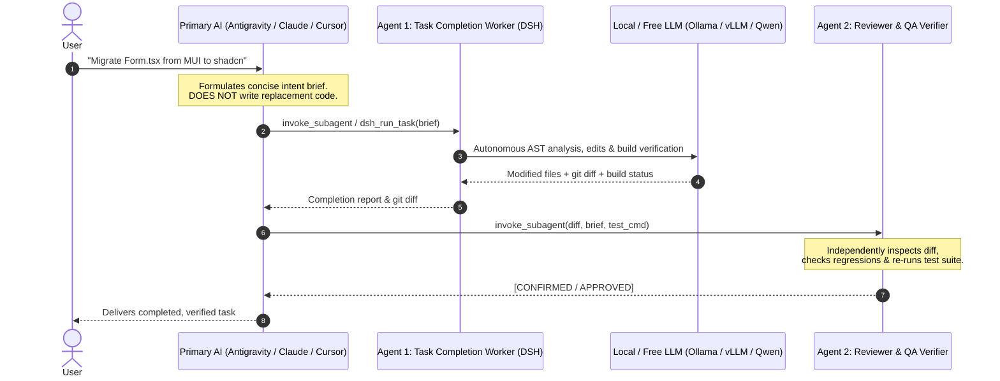

# ⚡ DSH-Agent-MCP: Zero-Cost Autonomous Dual-Agent Coding Engine

[](https://opensource.org/licenses/MIT)
[](https://nodejs.org)
[](https://modelcontextprotocol.io)
[](#-model-backend-configuration)

> **Model Context Protocol (MCP) server connecting Google Antigravity, Claude Code, and Cursor to DeepSeek Harness (`@deepseek-ai/dsh`) for $0-cost autonomous coding and dual-agent verification.**

📖 **Looking for internal design, sequence diagrams, and folder breakdown? Read the [Architecture & System Flow Guide](./ARCHITECTURE.md).**

---

## 🎯 The Problem & The Solution

Frontier LLMs (Gemini 1.5 Pro, Claude 3.5 Sonnet, GPT-4o) are phenomenal system architects, but using them to generate hundreds of lines of repetitive boilerplate, mechanical refactors, and test iteration code is:
1. **Expensive**: Burns significant paid API tokens.
2. **Prone to Hallucinated Regressions**: Without an independent verification loop, self-auditing often misses edge cases.

### The Solution: Dual-Agent Architecture
**DSH-Agent-MCP** turns your primary AI into a **Lead Architect** and delegates mechanical implementation to **DeepSeek Harness** running on your local or free model cluster (Ollama, vLLM, FreeToken, LM Studio), followed by an independent **Reviewer Agent** before any task is marked complete.



---

## ⚡ 60-Second Quickstart

### Prerequisites
- **Node.js** &ge; 20.0.0
- An OpenAI-compatible local/free model endpoint (e.g. [Ollama](https://ollama.com) running `qwen2.5-coder:32b` or `qwen3.8:27b`).

---

### Step 1: Clone and Run the 1-Command Setup

```bash
git clone https://github.com/Eklavya-San/dsh-agent-mcp.git
cd dsh-agent-mcp
./scripts/setup.sh
```

The installer will:
1. Install dependencies and compile TypeScript to `build/mcp.js`.
2. Initialize starter `~/.dsh/settings.yaml` (if not already present).
3. If Google Antigravity is detected, automatically install the subagents, rules, and skills into `~/.gemini/config/`.
4. Output the exact configuration block for your environment.

---

### Step 2: Configure Your AI Client

#### 1. Google Antigravity
The installer `./scripts/setup.sh` automatically installs the worker subagents. Simply add the MCP server to `~/.gemini/config/mcp_config.json`:

```json
{
  "mcpServers": {
    "dsh": {
      "command": "node",
      "args": ["/ABSOLUTE/PATH/TO/dsh-agent-mcp/build/mcp.js"],
      "env": {
        "DSH_MODEL_ENDPOINT": "http://localhost:11434/v1",
        "DSH_MODEL": "qwen2.5-coder:32b"
      }
    }
  }
}
```
*(Replace `/ABSOLUTE/PATH/TO/dsh-agent-mcp` with your actual cloned path. For global npm install, use `"command": "npx"`, `"args": ["-y", "dsh-agent-mcp"]`)*

#### 2. Claude Desktop / Claude Code
- **Claude Desktop**: Add to `claude_desktop_config.json`:
  ```json
  {
    "mcpServers": {
      "dsh": {
        "command": "node",
        "args": ["/ABSOLUTE/PATH/TO/dsh-agent-mcp/build/mcp.js"],
        "env": {
          "DSH_MODEL_ENDPOINT": "http://localhost:11434/v1",
          "DSH_MODEL": "qwen2.5-coder:32b"
        }
      }
    }
  }
  ```
- **Claude Code**: Copy [`integrations/claude/CLAUDE.md`](./integrations/claude/CLAUDE.md) to your user directory (`~/.claude/CLAUDE.md`) or into your project root.

#### 3. Cursor
Add to `.cursor/mcp.json` in your workspace or global Cursor settings:
```json
{
  "mcpServers": {
    "dsh": {
      "command": "node",
      "args": ["/ABSOLUTE/PATH/TO/dsh-agent-mcp/build/mcp.js"],
      "env": {
        "DSH_MODEL_ENDPOINT": "http://localhost:11434/v1",
        "DSH_MODEL": "qwen2.5-coder:32b"
      }
    }
  }
}
```

#### 4. Cline (VS Code Extension)
Add to `cline_mcp_settings.json`:
```json
{
  "mcpServers": {
    "dsh": {
      "command": "node",
      "args": ["/ABSOLUTE/PATH/TO/dsh-agent-mcp/build/mcp.js"],
      "env": {
        "DSH_MODEL_ENDPOINT": "http://localhost:11434/v1",
        "DSH_MODEL": "qwen2.5-coder:32b"
      }
    }
  }
}
```

---

## ⚙️ Model Backend Configuration (`~/.dsh/settings.yaml`)

DeepSeek Harness reads its model provider configuration from `~/.dsh/settings.yaml`. You can configure any OpenAI-compatible provider:

### Option A: Local Ollama (Default)
```yaml
ui-theme:
  preference: dark

agent-default-model:
  provider: ollama
  model: qwen2.5-coder:32b

providers:
  ollama:
    api: openai-completions
    baseURL: http://localhost:11434/v1
    models:
      - id: qwen2.5-coder:32b
      - id: qwen3.8:27b
    apiKeyEnv: OLLAMA_API_KEY
```

### Option B: vLLM / SGLang Cluster
```yaml
agent-default-model:
  provider: vllm
  model: Qwen/Qwen2.5-Coder-32B-Instruct

providers:
  vllm:
    api: openai-completions
    baseURL: http://localhost:8000/v1
    models:
      - id: Qwen/Qwen2.5-Coder-32B-Instruct
```

### Option C: LM Studio
```yaml
agent-default-model:
  provider: lmstudio
  model: qwen2.5-coder-32b-instruct

providers:
  lmstudio:
    api: openai-completions
    baseURL: http://localhost:1234/v1
    models:
      - id: qwen2.5-coder-32b-instruct
```

---

## 🔧 DeepSeek Harness Binary Resolution

`dsh-agent-mcp` resolves the DeepSeek Harness executable in the following priority order:
1. **Explicit `DSH_BIN` environment variable**: If you have a custom DSH binary or wrapper, set `DSH_BIN="/path/to/dsh"` in your shell or MCP `env`.
2. **System `PATH`**: Checks if `dsh` is in your `$PATH` (`which dsh`).
3. **Fallback**: Attempts `npx -y @deepseek-ai/dsh`.

To verify your environment anytime:
```bash
npm run doctor
```

---

## 🛠️ MCP Tools Exposed

| Tool | Description |
| :--- | :--- |
| `dsh_run_task` | Dispatches an autonomous coding task to DeepSeek Harness in headless mode with git diff calculation and real-time activity tracking. |
| `dsh_doctor` | Checks DSH installation, endpoint connectivity, latency, settings, and Web UI status. |
| `dsh_web_status` | Checks if the official DSH Web UI companion is running on port 3080. |
| `dsh_web_start` | Spawns the DSH Web UI companion in background daemon mode (`http://127.0.0.1:3080`). |
| `dsh_web_stop` | Terminates the running DSH Web UI companion process. |
| `dsh_list_sessions` | Discovers and inspects previous session histories stored in `~/.dsh/sessions/`. |

---

## 💻 CLI Companion: `dsh-live`

For interactive or visible streaming directly in your integrated terminal:

```bash
# Stream live thinking tokens, tool calls, and syntax-highlighted markdown
./bin/dsh-live --cwd "/path/to/project" "Refactor auth middleware to use JWT and verify with npm test"
```

---

## 📋 The Architect Prompting Doctrine

To maximize autonomous reasoning and eliminate token waste, follow this simple protocol:

### ❌ BANNED (Micromanaging / Burning Paid Tokens)
```text
Replace lines 135-255 of Form.tsx with:
<Dialog open={open}>
  ... 150 lines of frontier LLM pre-written code ...
</Dialog>
```

### ✅ REQUIRED (High-Level Intent Brief)
```text
Task for src/components/Form.tsx:
1. Migrate the component modal and selects from MUI to shadcn/ui.
2. Maintain existing form state, submit handlers, and validation logic.
3. Replace MUI sx styling with Tailwind CSS utility classes.
4. Verify by running 'npm test'.
```

---

## 📦 Ready-to-Use Integrations

This repository includes copy-paste templates in the [`integrations/`](./integrations) folder:
- **`integrations/antigravity/`**: Subagent definitions (`dsh-worker.md`, `reviewer-worker.md`), dual-agent rules, and [setup guide](./integrations/antigravity/README.md).
- **`integrations/claude/`**: `CLAUDE.md` and desktop config.
- **`integrations/cursor/`**: `.cursorrules` and `mcp.json`.
- **`integrations/cline/`**: `cline_mcp_settings.json`.

---

## 📄 License

MIT &copy; 2026 [Eklavya](https://github.com/Rauglothgor)
