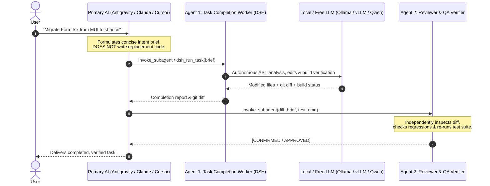

# ⚡ DSH-Agent-MCP: Zero-Cost Autonomous Dual-Agent Coding Engine

[](https://opensource.org/licenses/MIT)
[](https://nodejs.org)
[](https://modelcontextprotocol.io)
[](#supported-model-backends)

> **Model Context Protocol (MCP) server connecting Google Antigravity, Claude Code, and Cursor to DeepSeek Harness (`@deepseek-ai/dsh`) for $0-cost autonomous coding and dual-agent verification.**

---

## 🎯 The Problem & The Solution

Frontier LLMs (Gemini 1.5 Pro, Claude 3.5 Sonnet, GPT-4o) are phenomenal system architects, but using them to generate hundreds of lines of repetitive boilerplate, mechanical refactors, and test iteration code is:
1. **Expensive**: Burns significant paid API tokens.
2. **Prone to Hallucinated Regressions**: Without an independent verification loop, self-auditing often misses edge cases.

### The Solution: Dual-Agent Architecture
**DSH-Agent-MCP** turns your primary AI into a **Lead Architect** and delegates mechanical implementation to **DeepSeek Harness** running on your local or free model cluster (Ollama, vLLM, FreeToken, LM Studio), followed by an independent **Reviewer Agent** before any task is marked complete.



---

## ⚡ 60-Second Quickstart

### 1. Prerequisites
- **Node.js** &ge; 20.0.0
- A local or remote model endpoint (e.g., [Ollama](https://ollama.com) running `qwen2.5-coder:32b`, `qwen3.8:27b`, or `deepseek-coder-v2`).

### 2. Configure Your AI IDE

#### Google Antigravity
Add to your `mcp_config.json` (`~/.gemini/config/mcp_config.json`):
```json
{
  "mcpServers": {
    "dsh": {
      "command": "npx",
      "args": ["-y", "dsh-agent-mcp"],
      "env": {
        "DSH_BACKEND_TYPE": "ollama",
        "DSH_MODEL_ENDPOINT": "http://localhost:11434/v1",
        "DSH_MODEL": "qwen2.5-coder:32b"
      }
    }
  }
}
```

#### Claude Desktop / Claude Code
Add to `claude_desktop_config.json`:
```json
{
  "mcpServers": {
    "dsh": {
      "command": "npx",
      "args": ["-y", "dsh-agent-mcp"],
      "env": {
        "DSH_BACKEND_TYPE": "ollama",
        "DSH_MODEL_ENDPOINT": "http://localhost:11434/v1",
        "DSH_MODEL": "qwen2.5-coder:32b"
      }
    }
  }
}
```

#### Cursor
Add to `.cursor/mcp.json` in your workspace:
```json
{
  "mcpServers": {
    "dsh": {
      "command": "npx",
      "args": ["-y", "dsh-agent-mcp"],
      "env": {
        "DSH_BACKEND_TYPE": "ollama",
        "DSH_MODEL_ENDPOINT": "http://localhost:11434/v1",
        "DSH_MODEL": "qwen2.5-coder:32b"
      }
    }
  }
}
```

---

## 🛠️ MCP Tools Exposed

| Tool | Description |
| :--- | :--- |
| `dsh_run_task` | Dispatches an autonomous coding task to DeepSeek Harness in headless mode with git diff calculation and real-time activity tracking. |
| `dsh_doctor` | Checks DSH installation, endpoint connectivity, latency, settings, and Web UI status. |
| `dsh_web_status` | Checks if the official DSH Web UI companion is running on port 3080. |
| `dsh_web_start` | Spawns the DSH Web UI companion in background daemon mode (`http://127.0.0.1:3080`). |
| `dsh_web_stop` | Terminates the running DSH Web UI companion process. |
| `dsh_list_sessions` | Discovers and inspects previous session histories stored in `~/.dsh/sessions/`. |

---

## 💻 CLI Companion: `dsh-live`

For interactive or visible streaming directly in your integrated terminal:

```bash
# Stream live thinking tokens, tool calls, and syntax-highlighted markdown
dsh-live --cwd "/path/to/project" "Refactor auth middleware to use JWT and verify with npm test"
```

---

## 🤖 Supported Model Backends

| Backend | Example Config | Default Endpoint |
| :--- | :--- | :--- |
| **Ollama** | `DSH_MODEL: "qwen2.5-coder:32b"` | `http://localhost:11434/v1` |
| **vLLM / SGLang** | `DSH_MODEL: "Qwen/Qwen2.5-Coder-32B-Instruct"` | `http://localhost:8000/v1` |
| **LM Studio** | `DSH_MODEL: "qwen2.5-coder-32b-instruct"` | `http://localhost:1234/v1` |
| **FreeToken Cluster** | `DSH_MODEL: "Qwen3.6-35B-A3B-NVFP4"` | `http://<your-cluster>:10346/v1` |
| **DeepSeek Official API** | `DSH_MODEL: "deepseek-coder"` | `https://api.deepseek.com/v1` |

---

## 📋 The Architect Prompting Doctrine

To maximize autonomous reasoning and eliminate token waste, follow this simple protocol:

### ❌ BANNED (Micromanaging / Burning Paid Tokens)
```text
Replace lines 135-255 of Form.tsx with:
<Dialog open={open}>
  ... 150 lines of frontier LLM pre-written code ...
</Dialog>
```

### ✅ REQUIRED (High-Level Intent Brief)
```text
Task for src/components/Form.tsx:
1. Migrate the component modal and selects from MUI to shadcn/ui.
2. Maintain existing form state, submit handlers, and validation logic.
3. Replace MUI sx styling with Tailwind CSS utility classes.
4. Verify by running 'npm test'.
```

---

## 📦 Ready-to-Use Integrations

This repository includes copy-paste templates in the [`integrations/`](./integrations) folder:
- **`integrations/antigravity/`**: Subagent definitions (`dsh-worker.md`, `reviewer-worker.md`) and dual-agent rules.
- **`integrations/claude/`**: `CLAUDE.md` and desktop config.
- **`integrations/cursor/`**: `.cursorrules` and `mcp.json`.
- **`integrations/cline/`**: `cline_mcp_settings.json`.

---

## 📄 License

MIT &copy; 2026 [Eklavya](https://github.com/Rauglothgor)
