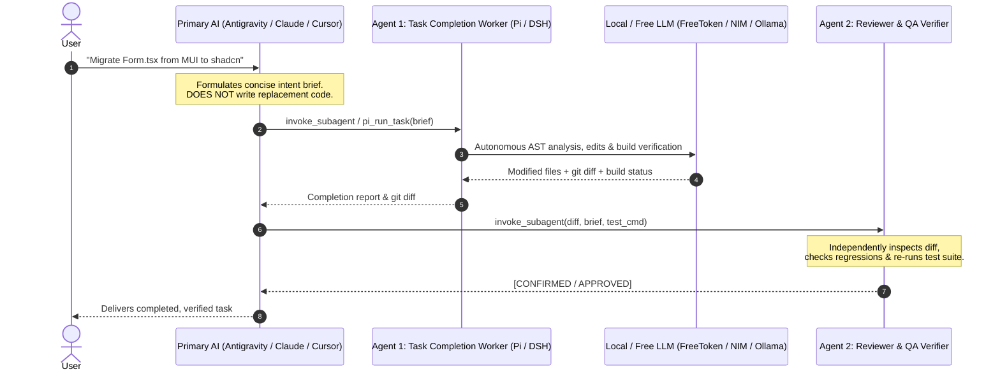

# ⚡ Pi-Agent-MCP: Zero-Cost Autonomous Dual-Agent Coding Engine

[](https://opensource.org/licenses/MIT)
[](https://nodejs.org)
[](https://modelcontextprotocol.io)
[](#-model-backend-configuration)

> **Model Context Protocol (MCP) server connecting Google Antigravity, Claude Code, and Cursor to the Pi Coding Agent (`pi`) and DeepSeek Harness (`dsh`) for $0-cost autonomous coding, live terminal streaming, and dual-agent verification.**

📖 **Looking for internal design, sequence diagrams, and folder breakdown? Read the [Architecture & System Flow Guide](./ARCHITECTURE.md).**

---

## 🎯 The Problem & The Solution

Frontier harnesses plans (claude, antigravity) are phenomenal system architects, but using them to generate hundreds of lines of repetitive boilerplate, mechanical refactors, and test iteration code is:
1. **Expensive**: Burns significant paid API tokens.
2. **Prone to Hallucinated Regressions**: Without an independent verification loop, self-auditing often misses edge cases.

### The Solution: Dual-Agent Architecture
**Pi-Agent-MCP** turns your primary AI into a **Lead Architect** and delegates mechanical implementation to the **Pi Coding Agent** (or DeepSeek Harness) running on your local or free model cluster (FreeToken Qwen 35B, NVIDIA NIM Nemotron, Ollama, OpenRouter), followed by an independent **Reviewer Agent** before any task is marked complete.


```mermaid
sequenceDiagram
    autonumber
    actor User
    participant Architect as Primary AI (Antigravity / Claude / Cursor)
    participant Worker as Agent 1: Task Completion Worker (Pi / DSH)
    participant Cluster as Local / Free LLM (FreeToken / NIM / Ollama)
    participant Reviewer as Agent 2: Reviewer & QA Verifier

    User->>Architect: "Migrate Form.tsx from MUI to shadcn"
    Note over Architect: Formulates concise intent brief.<br/>DOES NOT write replacement code.
    Architect->>Worker: invoke_subagent / pi_run_task(brief)
    Worker->>Cluster: Autonomous AST analysis, edits & build verification
    Cluster-->>Worker: Modified files + git diff + build status
    Worker-->>Architect: Completion report & git diff
    Architect->>Reviewer: invoke_subagent(diff, brief, test_cmd)
    Note over Reviewer: Independently inspects diff,<br/>checks regressions & re-runs test suite.
    Reviewer-->>Architect: [CONFIRMED / APPROVED]
    Architect-->>User: Delivers completed, verified task
```

---

## ⚡ 60-Second Quickstart

### Prerequisites
- **Node.js** &ge; 20.0.0
- Pi CLI (`pi`) installed or configured via `PI_BIN` (or DeepSeek Harness via `dsh` / `DSH_BIN`)
- A supported model backend: FreeToken (self-hosted Qwen 35B at $0 cost), NVIDIA NIM, Ollama, or OpenRouter.

---

### Step 1: Clone and Run the 1-Command Setup

```bash
git clone https://github.com/Eklavya-San/dsh-agent-mcp.git
cd dsh-agent-mcp
./scripts/setup.sh
```

The installer will:
1. Install dependencies and compile TypeScript to `build/mcp.js` and `build/web.js`.
2. Configure CLI binaries (`pi-live`, `dsh-live`) with executable permissions.
3. If Google Antigravity is detected, automatically install subagents (`pi-worker.md`, `reviewer-worker.md`), dual-agent rules (`AGENTS.md`), and skills (`pi-orchestration`) into `~/.gemini/config/`.
4. Register the MCP server in `~/.gemini/config/mcp_config.json`.
5. Announce the real-time Web UI Dashboard available at `http://127.0.0.1:7081`.

---

### Step 2: Configure Your AI Client

#### 1. Google Antigravity
The installer `./scripts/setup.sh` automatically installs the worker subagents and MCP registration. Simply confirm `~/.gemini/config/mcp_config.json`:

```json
{
  "mcpServers": {
    "pi-agent": {
      "command": "node",
      "args": ["/ABSOLUTE/PATH/TO/dsh-agent-mcp/build/mcp.js"],
      "env": {
        "FREETOKEN_BASE_URL": "http://machinewiseapp.in:10346/v1",
        "PI_DEFAULT_PROVIDER": "freetoken"
      }
    }
  }
}
```
*(Replace `/ABSOLUTE/PATH/TO/dsh-agent-mcp` with your actual cloned path. The `dsh` server alias is also registered for backward compatibility).*

#### 2. Claude Desktop / Claude Code
- **Claude Desktop**: Add to `claude_desktop_config.json`:
  ```json
  {
    "mcpServers": {
      "pi-agent": {
        "command": "node",
        "args": ["/ABSOLUTE/PATH/TO/dsh-agent-mcp/build/mcp.js"],
        "env": {
          "FREETOKEN_BASE_URL": "http://machinewiseapp.in:10346/v1",
          "PI_DEFAULT_PROVIDER": "freetoken"
        }
      }
    }
  }
  ```
- **Claude Code**: Copy [`integrations/claude/CLAUDE.md`](./integrations/claude/CLAUDE.md) to your user directory (`~/.claude/CLAUDE.md`) or into your project root.

#### 3. Cursor
Add to `.cursor/mcp.json` in your workspace or global Cursor settings:
```json
{
  "mcpServers": {
    "pi-agent": {
      "command": "node",
      "args": ["/ABSOLUTE/PATH/TO/dsh-agent-mcp/build/mcp.js"],
      "env": {
        "FREETOKEN_BASE_URL": "http://machinewiseapp.in:10346/v1",
        "PI_DEFAULT_PROVIDER": "freetoken"
      }
    }
  }
}
```

#### 4. Cline (VS Code Extension)
Add to `cline_mcp_settings.json`:
```json
{
  "mcpServers": {
    "pi-agent": {
      "command": "node",
      "args": ["/ABSOLUTE/PATH/TO/dsh-agent-mcp/build/mcp.js"],
      "env": {
        "FREETOKEN_BASE_URL": "http://machinewiseapp.in:10346/v1",
        "PI_DEFAULT_PROVIDER": "freetoken"
      }
    }
  }
}
```

---

## 🌐 Pi Agent MCP Web Dashboard (Port 7081)

Pi-Agent-MCP includes a high-performance, dark-mode visual web dashboard running at **`http://127.0.0.1:7081`**. It provides complete real-time observability into active Pi worker processes, execution history, provider diagnostics, and configuration without leaving your browser or IDE.

### 🌟 Key Features
- **Real-Time Active Worker Monitoring**: Inspect running coding workers with live elapsed timers, target workspace paths, and active task briefs.
- **Live Terminal Streaming (SSE)**: Watch Pi agent execution in real-time via Server-Sent Events (`/api/events`) with terminal ANSI color rendering, streaming tool calls, code modifications, and subagent output.
- **Instant 1-Click Task Cancellation ("Abort Worker")**: Instantly abort runaway or stalled worker processes via the interactive UI or `POST /api/cancel`.
- **Dynamic Provider & Model Discovery**: Inspect and discover all configured models and providers dynamically loaded from `~/.pi/agent/models.json` and `~/.pi/agent/settings.json` (FreeToken Qwen 35B, NVIDIA NIM Nemotron, Ollama, OpenRouter).
- **Interactive Provider Diagnostics**: Benchmark latency and validate endpoint reachability directly from the UI (`POST /api/test-provider`).

### 🚀 Starting the Web Dashboard
You can launch the Web Dashboard in multiple ways:

```bash
# Start directly from CLI:
npm run web

# Or with a custom port:
node build/web.js --port 7081
```

Alternatively, manage the dashboard programmatically via MCP tools:
- `pi_web_start` (or `dsh_web_start`) — Spawns the Web Dashboard as a background daemon process.
- `pi_web_status` (or `dsh_web_status`) — Checks whether the dashboard is running, port, PID, and active task count.
- `pi_web_stop` (or `dsh_web_stop`) — Safely shuts down the dashboard daemon process.

### 🔌 REST & Event API Endpoints
The companion server exposes a native, lightweight HTTP REST and Server-Sent Events API on port 7081:

| Method | Endpoint | Description |
| :--- | :--- | :--- |
| `GET` | `/` | Obsidian dark-mode SPA dashboard (HTML/CSS/JS). |
| `GET` | `/api/status` | Current server status, port, uptime, and active task count. |
| `GET` | `/api/config` | Discovered providers and models from `~/.pi/agent/models.json` and `settings.json`. |
| `GET` | `/api/doctor` | Comprehensive system health check, binary info, and provider latency benchmarks. |
| `GET` | `/api/events` | Real-time Server-Sent Events (SSE) stream (`worker_output`, `task_started`, `task_finished`, `task_cancelled`). |
| `POST` | `/api/cancel` | Terminates an active worker process by `taskId` (`{ "taskId": "..." }`). |
| `POST` | `/api/test-provider` | Tests and benchmarks reachability for a specific provider (`{ "providerId": "..." }`). |

---

## ⚙️ Model Backend Configuration

Pi Coding Agent and DSH read model provider configurations dynamically from `~/.pi/agent/models.json` and `~/.dsh/settings.yaml`. You can configure any OpenAI-compatible provider:

### Option A: FreeToken Cluster (Recommended $0-Cost Default)
Set the environment variables in your MCP configuration:
```json
"env": {
  "FREETOKEN_BASE_URL": "http://machinewiseapp.in:10346/v1",
  "PI_DEFAULT_PROVIDER": "freetoken"
}
```

### Option B: Local / Remote Ollama
```json
"env": {
  "OLLAMA_BASE_URL": "http://localhost:11434/v1",
  "PI_DEFAULT_PROVIDER": "ollama"
}
```
Or in `~/.pi/agent/models.json`:
```json
{
  "providers": [
    {
      "id": "ollama",
      "baseUrl": "http://localhost:11434/v1",
      "model": "qwen2.5-coder:32b"
    }
  ]
}
```

### Option C: NVIDIA NIM
Set `NVIDIA_API_KEY` in your environment or MCP config. Pi Agent connects to `https://integrate.api.nvidia.com/v1` targeting `nvidia/nemotron-3.5-lightning-30b-a3b`.

### Option D: OpenRouter
Set `OPENROUTER_API_KEY` in your environment. Pi Agent connects to `https://openrouter.ai/api/v1` targeting `qwen/qwen3-coder`.

---

## 🔧 Binary Resolution

`pi-agent-mcp` resolves the agent executable in the following priority order:
1. **Explicit `PI_BIN` environment variable**: If you have a custom Pi binary or wrapper, set `PI_BIN="/path/to/pi"`.
2. **System `PATH`**: Resolves `which pi` automatically.
3. **DeepSeek Harness Fallback**: If Pi CLI is absent and DSH is installed, falls back seamlessly to `dsh` (or `DSH_BIN` / `npx -y @deepseek-ai/dsh`).

To verify your environment anytime:
```bash
npm run doctor
```

---

## 🛠️ MCP Tools Exposed

| Tool | Alias | Description |
| :--- | :--- | :--- |
| `pi_run_task` | `dsh_run_task` | Dispatches an autonomous coding task to the Pi Coding Agent in headless mode with multi-repo git diff calculation and $0 front-end token burn. |
| `pi_doctor` | `dsh_doctor` | Comprehensive health check inspecting Pi binary installation and testing endpoint latency across all configured providers. |
| `pi_list_providers` | — | Lists configured inference providers (FreeToken, NVIDIA NIM, Ollama, OpenRouter) with default models and base URLs. |
| `pi_cancel_task` | `dsh_cancel_task` | Instantly aborts an active coding worker process by `taskId`. |
| `pi_list_active_tasks` | `dsh_list_active_tasks` | Lists currently active coding tasks with elapsed execution time and target workspace. |
| `pi_review_task` | `dsh_review_task` | Independent QA verification tool that audits git diffs, executes test suites, and evaluates architectural intent compliance. |
| `pi_web_start` | `dsh_web_start` | Starts the Pi Agent Web UI companion dashboard as a detached background daemon (`http://127.0.0.1:7081`). |
| `pi_web_status` | `dsh_web_status` | Checks if the Web UI companion dashboard is running, port number, PID, and active task count. |
| `pi_web_stop` | `dsh_web_stop` | Safely terminates the running Web UI companion dashboard daemon process. |

---

## 💻 CLI Companions: `pi-live` & `dsh-live`

For interactive or visible streaming directly in your integrated terminal:

```bash
# Stream live thinking tokens, tool calls, and syntax-highlighted markdown with Pi:
./bin/pi-live --cwd "/path/to/project" "Refactor auth middleware to use JWT and verify with npm test"

# Or with DeepSeek Harness:
./bin/dsh-live --cwd "/path/to/project" "Refactor auth middleware to use JWT and verify with npm test"
```

---

## 📋 The Architect Prompting Doctrine

To maximize autonomous reasoning and eliminate token waste, follow this simple protocol:

### ❌ BANNED (Micromanaging / Burning Paid Tokens)
```text
Replace lines 135-255 of Form.tsx with:
<Dialog open={open}>
  ... 150 lines of frontier LLM pre-written code ...
</Dialog>
```

### ✅ REQUIRED (High-Level Intent Brief)
```text
Task for src/components/Form.tsx:
1. Migrate the component modal and selects from MUI to shadcn/ui.
2. Maintain existing form state, submit handlers, and validation logic.
3. Replace MUI sx styling with Tailwind CSS utility classes.
4. Verify by running 'npm test'.
```

---

## 📦 Ready-to-Use Integrations

This repository includes copy-paste templates in the [`integrations/`](./integrations) folder:
- **`integrations/antigravity/`**: Subagent definitions (`dsh-worker.md`, `reviewer-worker.md`), dual-agent rules, and [setup guide](./integrations/antigravity/README.md).
- **`integrations/claude/`**: `CLAUDE.md` and desktop config.
- **`integrations/cursor/`**: `.cursorrules` and `mcp.json`.
- **`integrations/cline/`**: `cline_mcp_settings.json`.

---

## 📄 License

MIT &copy; 2026 [Eklavya](https://github.com/Eklavya-San)
